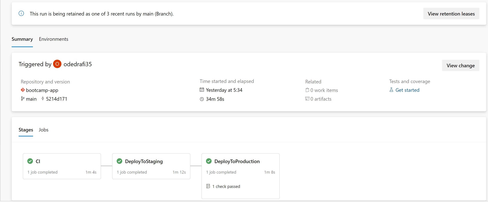

# CI/CD Pipeline

  

                                     

# Description

hi!! have you ever wanted to integrate your nodejs app on a CI\CD with azure devops?. this is the place for you !
in here we will try to explain the steps to take inorder to make it work!

This project intales two Pipeline implimantations.
> univarsal packadge pipline that uses azure artifact to store our CI build(with file "azure-pipelines.yaml")
> Docker packadging of our app in the CI build.and storing it in docker hub(with file "azure-docker-pipeline.yaml")

Both of thouse implimantations uses the power Ansible to deploy the app to our Environments. the ansible playbook and inventory files are located in folders:
> ansiblePipelineFiles
> Docker-Pipeline

this project is part of bottcamp in sela[Sela DevOps Bootcamp Page](https://rhinops.io/bootcamp).

ci\cd illustration

## Requirements:

- Install Docker on each of the virtual machines by these commands:
  >sudo apt-get update 
  apt-get upgrade -y
  curl -fsSL https://get.docker.com/ -o get-docker.sh
  bash get-docker.sh
  sudo chmod 666 /var/run/docker.sock (to make the container accesible)  
- Node.js 14.x 
- PostgreSQL (can be installed locally using Docker)
- Free Okta developer account for account registration, login
## Deployment

This project dosn't yet containe a ci\cd pipeline for infrastructureso it will have to be deployd manually.
### Create an azure devops project:
##### deployment of universal packadge Pipeline:
In the azure devops UI we can intigrate everything we need for the project .

> here are the steps demonstrated in this pproject

- import your app repo to Azure Repo
  > for the purpose of this exersize will need to add
  > a playbook.yaml for cd deployment with ansible
- Go to Azure Pipelines tab and start a new pipeline using a multi staged yaml(not classic) file
- We will run a simple dependacies installation and archive our solution as an artifact and Publish it(save it) to Azure artifacts
  for that purpose we can use the command which is suited for ci testing :

  > $ [npm ci](https://docs.npmjs.com/cli/v8/commands/npm-ci)

- Using the show assistant on the top right of your piprline in edit mode, you can saerch for the action you want to preform. this will give us a blook of the command in yaml.
- CD deployment default in the yaml pipeline version is auto (continues deployment) to change that will need to add an Enviroment and add an encapsulaion of the stage we want to control the deployment of, to our yaml pipeline code.
- Now on every commit your pipeline will start the ci\cd procces.
##### deployment of the docker pipeline:
In this Pipeline we will manage the code of our application using a simple Git workflow called the “Feature Branch Workflow” in which branches named with the prefix “feature/” are used to work on the code independently and then the code is integrated into the master/main branch to be deployed in the target environments.

To optimize our worflow will configure a branch policy for the master/main branch to enforce Code Review by using Pull Requests and a Build Validation Policy to ensure that the changes are ok before integrating them. as shown in the example below:

The CI/CD process will meet the following requirements:

- For Feature Branches:
   >Whenever a new change is pushed to a feature branch this should start the CI pipeline that will take the Dockerfile from the repository and build an image, then the CD procces will deploy it to staging environment automatically to insure everything is o.k.
- For Master/Main Branches:
  >Whenever a new change is pushed to the main/master branch this should start the CI process that will take the Dockerfile from the repository, build an image and push it to a container registry (Docker Hub in our case).
  
  >Then the CD consists on pulling the image from the registry and deploying it into the staging environments automatically (Continuous Deployment) and then wait for approval to deploy into the Production environment (Continuous Delivery)

  Docker container deployment:
  Forthis objective we will create a .env file for our nodejs app 
  and run the container with the respected flag to run it with our variables as shown in the example below:
  > docker run [--restart=always](https://docs.docker.com/config/containers/start-containers-automatically/) [--env-file](https://docs.docker.com/compose/env-file/)='.env' -d -p 0.0.0.0:8080:8080/tcp odedrafi/bootcampapp

ENV file format:

---

### Demo

---

### expected resultes

Universal packadge pipeline.

Docker pipeline.

---

### Links for tips and intructions

- [how to install Ansible](https://gitlab.com/ansible-workshop/labs/lab06)
- infrastructure Used in this project deployed by terraform[Terraform repo](https://github.com/odedrafi/SelaBootcampWeek5Terraform.git)
- [Multi-stage yaml syntax example](https://docs.microsoft.com/en-us/azure/devops/pipelines/process/stages?view=azure-devops&tabs=yaml)

